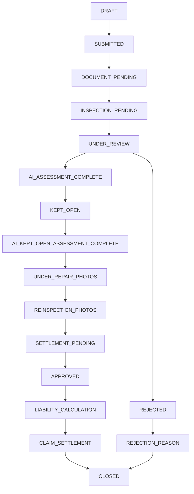

````md
# Claim Lifecycle


````


## State Flow


| Status                           | Meaning                                                                              |
| -------------------------------- | ------------------------------------------------------------------------------------ |
| DRAFT                            | Claim registration started but not submitted                                         |
| SUBMITTED                        | Customer submitted claim                                                             |
| DOCUMENT_PENDING                 | Mandatory documents are missing                                                      |
| INSPECTION_PENDING               | Initial inspection and image analysis pending                                        |
| UNDER_REVIEW                     | Claims team reviewing claim details                                                  |
| AI_ASSESSMENT_COMPLETE           | AI damage assessment completed                                                       |
| KEPT_OPEN                        | Claim kept open for internal/hidden damage inspection after dismantling              |
| AI_KEPT_OPEN_ASSESSMENT_COMPLETE | AI assessment completed for newly identified internal damages and labor requirements |
| UNDER_REPAIR_PHOTOS              | Garage uploads repair progress photos                                                |
| REINSPECTION_PHOTOS              | Final repair photos submitted for verification                                       |
| SETTLEMENT_PENDING               | Awaiting settlement and approval workflow                                            |
| APPROVED                         | Claim approved                                                                       |
| LIABILITY_CALCULATION            | Liability report and payable amount calculation in progress                          |
| CLAIM_SETTLEMENT                 | Settlement amount processed and released                                             |
| REJECTED                         | Claim rejected                                                                       |
| REJECTION_REASON                 | Rejection rationale documented and communicated                                      |
| CLOSED                           | Claim lifecycle completed                                                            |
