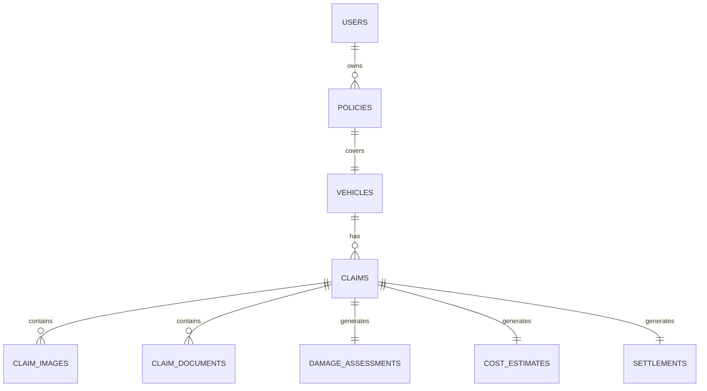

# Entity Relationship Diagram

```mermaid
erDiagram

    USERS ||--o{ POLICIES : owns

    POLICIES ||--|| VEHICLES : covers

    VEHICLES ||--o{ CLAIMS : has

    CLAIMS ||--o{ CLAIM_IMAGES : contains

    CLAIMS ||--o{ CLAIM_DOCUMENTS : contains

    CLAIMS ||--|| DAMAGE_ASSESSMENTS : generates

    CLAIMS ||--|| COST_ESTIMATES : generates

    CLAIMS ||--|| SETTLEMENTS : generates
```
